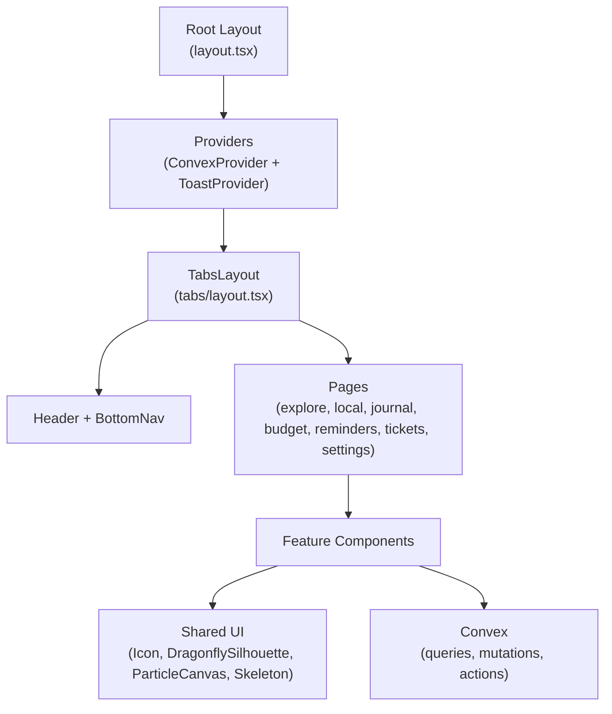

# Mom's Dragonfly — Definitive "Best We Can Do" Plan

> Every component read. Every bug verified in source. Every gap catalogued.
> The previous plan was good. This one is complete.

---

## What This Is

After reading every `.tsx` file in `src/` (87 components, pages, and hooks), running grep audits for undefined CSS classes, raw Unicode characters, and native dialogs, this is the exhaustive list of everything between "current" and "best we can do."

---

## Architecture Snapshot



---

## User Review Required

> [!IMPORTANT]
> **One architectural question:** The `POIList` uses `react-window` for virtualisation but the list container is hardcoded to `height={400}`. On a phone in portrait mode this is about 55% of the visible viewport above the bottom nav — the list is never taller than 400px even when there are 50 POIs. The fix is to measure the available viewport height dynamically. This requires wrapping the list in a `ResizeObserver` div. Is this desirable, or is the fixed-height scroll acceptable?

> [!WARNING]
> Three `alert()` calls and one `window.confirm()` remain in the codebase — these use native browser chrome that is visually jarring and inconsistent. Replacing them with the new `ConfirmDialog` / `Toast` components is a breaking visual change (the flow is the same; the UI is different). If you want a fast path, I can suppress these in favour of using the existing Toast for alerts and defer the confirm dialog.

---

## Open Questions

> [!IMPORTANT]
> 1. **`DaysCounter` colour palette** — The component uses `primary-500` (gold #D4AF37) and `accent-500` (purple #6A4C93). The rest of the app uses `dragonfly.orange` as the active/accent colour. Should DaysCounter be updated to orange + gold to match the rest of the app?
> 2. **Splash subtitle** — Current: `"Your travel companion"` → proposed: `"Made with love, just for you"`. Approve?
> 3. **`ExpenseForm` category emojis in `<select>`** — Emoji in select options render unreliably on Android. Should we strip them and keep only the text labels?

---

## Complete Bug / Gap Inventory

### Tier 1 — Broken Right Now 🔴

These produce incorrect visual output or silent no-ops.

| # | File | Bug | Impact |
|---|---|---|---|
| 1 | `globals.css` | `animate-slide-up` undefined | Toast + InstallPrompt appear with no animation |
| 2 | `globals.css` | `animate-fade-in` undefined | DaysCounter appears with no animation |
| 3 | `globals.css` | `animate-scale-in` undefined | OCRResult card appears with no animation |
| 4 | `POICard.tsx` | Outer `className="..."` is literal `"..."` string | Card has no background, border, or hover state |
| 5 | `POICard.tsx` | "Details ›" rendered twice per card | Visual noise |
| 6 | `BudgetRing.tsx` | `<text className="text-2xl font-black">` | SVG text ignores Tailwind; renders tiny |
| 7 | `PlaceDetailsSheet.tsx` | Phone link uses `<Icon name="restaurant">` | Wrong icon on phone call link |
| 8 | `ExpenseForm.tsx` | `<div>` on line 90 has no indentation (misaligned from parent) | Code debt; invisible in output but causes linting drift |

### Tier 2 — Inconsistent / Polish 🟠

| # | File | Issue |
|---|---|---|
| 9 | `layout.tsx` | `⚙️` emoji in header Settings link (should be `<Icon name="settings">`) |
| 10 | `not-found.tsx` | `⚙️` emoji in Settings link (same issue) |
| 11 | `ReminderCard.tsx` | `✓` checkmark, `✕` delete button, `⏰` clock — three raw Unicode chars |
| 12 | `ExpenseList.tsx` | `✕` delete button |
| 13 | `Toast.tsx` | `✕` dismiss button |
| 14 | `InstallPrompt.tsx` | `✕` dismiss (×3), `📲` and `🌐` decorative emoji (×3) |
| 15 | `UpdateBanner.tsx` | `🔄` update emoji |
| 16 | `IntroVideoModal.tsx` | `▶` play button |
| 17 | `IntroVideo.tsx` | `▶` play, `✕` close |
| 18 | `ride/RideSheet.tsx` | `✓ Destination copied` raw Unicode in `<motion.p>` |
| 19 | `map/POIMarker.tsx` | `✓ Verify POI` raw text in map popup |
| 20 | `JournalClient.tsx` | Raw `lat.toFixed(4), lng.toFixed(4)` shown in pin list |
| 21 | `RideSheet.tsx` | Raw `lat.toFixed(5), lng.toFixed(5)` shown in destination card |
| 22 | `DaysCounter.tsx` | Uses `primary-500` (gold) and `accent-500` (purple) — out of sync with orange-based design |
| 23 | `OnboardingSlides.tsx` | CTA button uses `bg-primary-500` (gold) — should be orange to match all other CTAs |
| 24 | `SplashScreen.tsx` | Generic subtitle "Your travel companion" |
| 25 | `LocalClient.tsx` | `alert()` for geo error — jarring native dialog |
| 26 | `explore/page.tsx` | `alert()` for geo retry error — jarring native dialog |
| 27 | `JournalClient.tsx` | `window.confirm()` for note delete — jarring native dialog |
| 28 | `SettingsClient.tsx` | `confirm()` (no `window.`) for reset — jarring native dialog |

### Tier 3 — Code Quality / Maintainability 🟡

| # | File | Issue |
|---|---|---|
| 29 | `POIList.tsx` | `height={400}` hardcoded — list never grows beyond 400px |
| 30 | `PlaceDetailsSheet.tsx` | Lines 31 and 41 are 180+ chars; unreadable |
| 31 | `PlaceDetailsSheet.tsx` | Inline type cast `(res as { photos?: string[] })` — should be a named interface |
| 32 | `TicketsClient.tsx` | 80-line ticket detail dialog inline in page component |
| 33 | `TicketsClient.tsx` | `<header>` full-width but content below is `max-w-xl mx-auto` — inconsistent |
| 34 | `RemindersClient.tsx` | 200-char inline type annotation on line 20 |
| 35 | `globals.css` | Lines 10–20 define CSS vars (`--color-bg`, `--color-surface`, etc.) that are **never used** anywhere |
| 36 | Multiple | `bg-surface-900` / `bg-surface-950` used in 18 places — `surface.*` Tailwind tokens not mapped to `dragonfly.navy.*` consistently |

### Tier 4 — Accessibility 🟢

| # | File | Issue |
|---|---|---|
| 37 | `BottomNav.tsx` | `<motion.div role="button">` should be `<motion.button type="button">` |
| 38 | `SplashScreen.tsx` | Entire splash is `role="button"` with no `aria-label` |
| 39 | `TicketsClient.tsx` | Ticket detail modal `role="dialog"` missing `aria-describedby` |
| 40 | `layout.tsx` | `viewport.themeColor` single value; should specify `media` descriptors for light/dark |

---

## Proposed Changes

### Component: Global CSS ─────────────────────────────────────────

#### [MODIFY] `globals.css`

**Add the three missing keyframes** (these must be done first — every other fix depends on animations working):

```css
/* ── Missing animation keyframes ─────────────────────────────── */
@keyframes slide-up {
  from { opacity: 0; transform: translateY(12px); }
  to   { opacity: 1; transform: translateY(0); }
}
.animate-slide-up {
  animation: slide-up 0.25s cubic-bezier(0.34, 1.56, 0.64, 1) both;
}

@keyframes fade-in {
  from { opacity: 0; transform: translateY(6px); }
  to   { opacity: 1; transform: translateY(0); }
}
.animate-fade-in {
  animation: fade-in 0.4s ease-out both;
}

@keyframes scale-in {
  from { opacity: 0; transform: scale(0.94); }
  to   { opacity: 1; transform: scale(1); }
}
.animate-scale-in {
  animation: scale-in 0.3s cubic-bezier(0.34, 1.56, 0.64, 1) both;
}
```

**Remove the 10 orphaned CSS variables** (lines 10–20) — replace with a comment pointing to Tailwind tokens:

```diff
-    --color-bg: #061416;
-    --color-surface: #0a1f26;
-    --color-surface-elevated: #112d3a;
-    --color-primary: #319795;
-    --color-primary-hover: #2c7a7b;
-    --color-accent: #06b6d4;
-    --color-gold: #D4AF37;
-    --color-orange: #f97316;
-    --color-text: #f0f4f8;
-    --color-text-muted: #829ab1;
-    --color-border: #112d3a;
+    /* Design tokens live in tailwind.config.ts (dragonfly.* palette). */
+    /* Only functional CSS vars below: */
```

---

### Component: Root & Layout ─────────────────────────────────────

#### [MODIFY] `layout.tsx`

1. Replace raw `⚙️` emoji with `<Icon name="settings" size={20} />`
2. Update `viewport.themeColor` with `media` descriptors:

```tsx
export const viewport: Viewport = {
  themeColor: [
    { media: "(prefers-color-scheme: dark)",  color: "#061416" },
    { media: "(prefers-color-scheme: light)", color: "#ea580c" },
  ],
};
```

#### [MODIFY] `not-found.tsx`

Replace `⚙️` emoji with `<Icon name="settings" size={20} />`.

---

### Component: Shared UI ─────────────────────────────────────────

#### [NEW] `src/components/ui/ConfirmDialog.tsx`

Replaces all four `confirm()` / `alert()` calls across the codebase.

```tsx
"use client";
import { AnimatePresence, motion } from "framer-motion";
import { cn } from "@/lib/utils/cn";

interface ConfirmDialogProps {
  open: boolean;
  title: string;
  message: string;
  confirmLabel?: string;
  cancelLabel?: string;
  danger?: boolean;
  onConfirm: () => void;
  onCancel: () => void;
}

export function ConfirmDialog({
  open, title, message,
  confirmLabel = "Confirm", cancelLabel = "Cancel",
  danger = false, onConfirm, onCancel,
}: ConfirmDialogProps) {
  return (
    <AnimatePresence>
      {open && (
        <>
          <motion.div
            className="fixed inset-0 z-[100] bg-dragonfly-navy-950/80 backdrop-blur-sm"
            initial={{ opacity: 0 }} animate={{ opacity: 1 }} exit={{ opacity: 0 }}
            onClick={onCancel}
            aria-hidden="true"
          />
          <motion.div
            role="dialog" aria-modal="true" aria-labelledby="confirm-title"
            className="fixed inset-x-4 bottom-1/2 translate-y-1/2 z-[101] mx-auto max-w-sm glass-panel rounded-2xl p-6 shadow-strong"
            initial={{ scale: 0.92, opacity: 0, y: 12 }}
            animate={{ scale: 1, opacity: 1, y: 0 }}
            exit={{ scale: 0.92, opacity: 0, y: 12 }}
            transition={{ type: "spring", damping: 28, stiffness: 360 }}
          >
            <h3 id="confirm-title" className="font-bold text-dragonfly-navy-50 mb-2">{title}</h3>
            <p className="text-caption text-dragonfly-navy-400 mb-6">{message}</p>
            <div className="flex gap-2">
              <button
                type="button" onClick={onCancel}
                className="flex-1 rounded-xl border border-dragonfly-navy-700 text-dragonfly-navy-200 font-semibold py-2.5 min-h-[var(--touch-target)] transition-colors hover:bg-dragonfly-navy-800"
              >
                {cancelLabel}
              </button>
              <button
                type="button" onClick={onConfirm}
                className={cn(
                  "flex-1 rounded-xl font-semibold py-2.5 min-h-[var(--touch-target)] transition-colors",
                  danger
                    ? "bg-dragonfly-rose-500 hover:bg-dragonfly-rose-400 text-dragonfly-navy-50"
                    : "bg-dragonfly-orange-500 hover:bg-dragonfly-orange-400 text-dragonfly-navy-950"
                )}
              >
                {confirmLabel}
              </button>
            </div>
          </motion.div>
        </>
      )}
    </AnimatePresence>
  );
}
```

---

### Component: Shell ─────────────────────────────────────────────

#### [MODIFY] `BottomNav.tsx`

Replace `<motion.div role="button">` with `<motion.button>` inside each `<li>`:

```diff
-  <motion.div
-    onClick={() => handleTabClick(index)}
-    ...
-    role="button"
-    tabIndex={0}
-    onKeyDown={(e) => { if (e.key === "Enter" || e.key === " ") handleTabClick(index); }}
-  >
+  <motion.button
+    type="button"
+    onClick={() => handleTabClick(index)}
+    ...
+  >
```

#### [MODIFY] `Toast.tsx`

Replace `✕` with `<Icon name="close" size={16} />`.

#### [MODIFY] `InstallPrompt.tsx`

Replace all three `✕` dismiss buttons with `<Icon name="close" size={16} />`.
Replace `📲` and `🌐` with neutral text or small Icons — these decorative emoji are acceptable to keep with `aria-hidden` (they already are), but optionally replace with `<Icon name="map-pin">` and `<Icon name="compass">` for visual consistency.

#### [MODIFY] `UpdateBanner.tsx`

Replace `🔄 Update available` with `<Icon name="refresh" size={16} className="shrink-0" /> Update available`.

---

### Component: POI & Explore ────────────────────────────────────

#### [MODIFY] `POICard.tsx`

**Three changes in one:**

```tsx
// 1. Replace the broken outer div — literal "..." className removed,
//    proper card styling added, "Details ›" removed from name row (keep only in button row)
export function POICard({ poi, onVerify, onSelect, onShowOnMap, onRequestRide }: POICardProps) {
  return (
    <div
      onClick={() => onSelect?.(poi)}
      className={cn(
        "flex items-center gap-3 p-4 rounded-xl border border-dragonfly-navy-800",
        "bg-dragonfly-navy-900/70 backdrop-blur-sm shadow-soft",
        "cursor-pointer transition-all duration-fast",
        "hover:border-dragonfly-teal-500/40 hover:shadow-medium active:scale-[0.99]"
      )}
      role="button"
      tabIndex={0}
      onKeyDown={(e) => { if (e.key === "Enter" || e.key === " ") onSelect?.(poi); }}
      aria-label={`View details for ${poi.name}`}
    >
      {/* ... name + badges (no "Details ›" here) */}
      {/* ... action buttons row stays same */}
    </div>
  );
}
```

#### [MODIFY] `PlaceDetailsSheet.tsx`

1. Fix phone icon `name="restaurant"` → `name="phone"` (note: `phone` is not yet in Icon — add it)
2. Fix photo placeholder `name="restaurant"` → `name="camera"`
3. Split the 180+ char lines into readable multiline form
4. Extract typed response interface:

```tsx
interface PlaceDetailsResponse {
  photos?: string[];
  phone?: string;
  hours?: string[];
  ratingCount?: number;
}
```

5. Add `aria-describedby` pointing to the address paragraph

#### [MODIFY] `POIFilter.tsx`

The active pill uses `bg-primary-500` (gold) which is **correct** — it's the intended filter indicator colour. No change needed here.

#### [MODIFY] `POIList.tsx` *(optional — see User Review)*

Replace hardcoded `height={400}` with a responsive container height using `ResizeObserver`:

```tsx
const containerRef = useRef<HTMLDivElement>(null);
const [listHeight, setListHeight] = useState(400);

useEffect(() => {
  const el = containerRef.current;
  if (!el) return;
  const ro = new ResizeObserver(([entry]) => {
    // Clamp: minimum 300px, max 60vh-equivalent capped at 520px
    setListHeight(Math.min(520, Math.max(300, entry.contentRect.height)));
  });
  ro.observe(el);
  return () => ro.disconnect();
}, []);
```

---

### Component: Budget ────────────────────────────────────────────

#### [MODIFY] `BudgetRing.tsx`

Fix SVG `<text>` to use explicit SVG attributes instead of Tailwind class names:

```diff
-<text
-  x="50%" y="46%"
-  textAnchor="middle"
-  className="text-2xl font-black"
-  fill={color}
->
+<text
+  x="50%"
+  y="46%"
+  textAnchor="middle"
+  dominantBaseline="middle"
+  fontSize="28"
+  fontWeight="900"
+  fontFamily="Inter, system-ui, sans-serif"
+  fill={color}
+>
```

#### [MODIFY] `ExpenseList.tsx`

Replace `✕` delete button with `<Icon name="trash" size={16} />` (use trash not close, to match `TicketCard.tsx` which already uses trash).

Fix the `confirm()` pattern — `ExpenseList` doesn't actually have a confirm, just `onDelete` callback. The confirm guard lives in `BudgetDashboard.tsx` which calls `handleDeleteExpense` directly. Add a `ConfirmDialog` state there.

#### [MODIFY] `ExpenseForm.tsx`

Fix the indentation of the `<div>` on line 90 (leading spaces misaligned vs its siblings).

---

### Component: Reminders ─────────────────────────────────────────

#### [MODIFY] `ReminderCard.tsx`

Replace all three raw Unicode characters:

```diff
- {reminder.done && "✓"}
+ {reminder.done && <Icon name="check" size={14} />}

- <span>⏰ {due.toLocaleString()}</span>
+ <span className="inline-flex items-center gap-1">
+   <Icon name="bell" size={12} />
+   {due.toLocaleString()}
+ </span>

- ✕ {/* delete button content */}
+ <Icon name="close" size={16} />
```

---

### Component: Tickets ───────────────────────────────────────────

#### [NEW] `src/components/tickets/TicketDetailSheet.tsx`

Extract the 80-line inline dialog from `TicketsClient.tsx` (lines 323–412):

```tsx
// src/components/tickets/TicketDetailSheet.tsx
interface TicketDetailSheetProps {
  ticket: UITicket | null;
  currency: string;
  onClose: () => void;
  onDelete: (ticket: Ticket) => void;
}

export function TicketDetailSheet({ ticket, currency, onClose, onDelete }: TicketDetailSheetProps) {
  if (!ticket) return null;
  return (
    <div
      className="fixed inset-0 z-50 bg-black/80 backdrop-blur-sm flex items-center justify-center p-4"
      role="dialog"
      aria-modal="true"
      aria-labelledby="ticket-detail-title"
      aria-describedby="ticket-detail-desc"
      onClick={onClose}
    >
      <div
        className="w-full max-w-md bg-dragonfly-navy-900 border border-dragonfly-navy-700 rounded-2xl overflow-hidden shadow-strong"
        onClick={(e) => e.stopPropagation()}
      >
        {/* ... existing content, with aria IDs wired up ... */}
      </div>
    </div>
  );
}
```

#### [MODIFY] `TicketsClient.tsx`

1. Import and use `TicketDetailSheet` instead of inline dialog
2. Fix `<header>` width inconsistency — wrap in `max-w-xl mx-auto`:

```diff
-<header className="px-4 py-3 border-b border-dragonfly-navy-800">
+<header className="px-4 py-3 border-b border-dragonfly-navy-800 max-w-xl mx-auto">
```

#### [MODIFY] `OCRResult.tsx`

Replace `✨` emoji in the Gemini button with text-based label (emoji in buttons is inconsistent):

```diff
- {isRetrying ? "Analyzing with Gemini AI..." : "✨ Analyze with Gemini Vision"}
+ {isRetrying ? "Analyzing with Gemini AI..." : "Analyze with Gemini Vision"}
```

---

### Component: Onboarding ────────────────────────────────────────

#### [MODIFY] `DaysCounter.tsx`

Align colours to orange-based design system and add `animate-fade-in` (now defined):

```diff
- className="p-3 bg-primary-500/10 border border-primary-500/20 rounded-xl text-center animate-fade-in"
+ className="p-3 bg-dragonfly-orange-500/10 border border-dragonfly-orange-500/20 rounded-xl text-center animate-fade-in"

- <div className="text-3xl font-black text-primary-500 leading-none">
+ <div className="text-3xl font-black text-dragonfly-orange-400 leading-none">

- <p className="text-caption font-bold text-primary-400 mt-1 uppercase tracking-wide">
+ <p className="text-caption font-bold text-dragonfly-orange-300 mt-1 uppercase tracking-wide">
```

#### [MODIFY] `OnboardingSlides.tsx`

Align the CTA button to orange (the universal CTA colour):

```diff
- className="... bg-primary-500 hover:bg-primary-400 ..."
+ className="... bg-dragonfly-orange-500 hover:bg-dragonfly-orange-400 ..."
```

#### [MODIFY] `SplashScreen.tsx`

```diff
- Your travel companion
+ Made with love, just for you
```

#### [MODIFY] `IntroVideoModal.tsx`

Replace the raw `"▶"` play button content with an SVG play icon (more polished, sizing controlled):

```diff
- ) : (
-   "▶"
- )}
+ ) : (
+   <svg viewBox="0 0 24 24" className="w-7 h-7 md:w-8 md:h-8" fill="currentColor">
+     <path d="M8 5.14v14l11-7-11-7z" />
+   </svg>
+ )}
```

---

### Component: Journal ───────────────────────────────────────────

#### [MODIFY] `JournalClient.tsx`

1. Replace native `window.confirm()` with `ConfirmDialog`:

```tsx
const [confirmDelete, setConfirmDelete] = useState<string | null>(null);

const handleDeleteNote = (id: string) => {
  setConfirmDelete(id);
};

// In JSX:
<ConfirmDialog
  open={!!confirmDelete}
  title="Delete this note?"
  message="This can't be undone."
  confirmLabel="Delete"
  danger
  onConfirm={() => {
    if (confirmDelete) {
      deleteNoteMut({ id: confirmDelete as Id<"journalNotes">, deviceId })
        .catch((err) => console.warn("Note delete failed:", err));
    }
    setConfirmDelete(null);
  }}
  onCancel={() => setConfirmDelete(null)}
/>
```

2. Replace raw coordinates in pin list with clean timestamps only:

```diff
- <span className="font-mono text-dragonfly-navy-500">
-   {p.lat.toFixed(4)}, {p.lng.toFixed(4)}
- </span>
+ <span className="text-caption text-dragonfly-navy-500">
+   {new Date(p.timestamp).toLocaleTimeString("en-ZA", { hour: "2-digit", minute: "2-digit" })}
+ </span>
```

---

### Component: Local & Explore ──────────────────────────────────

#### [MODIFY] `LocalClient.tsx`

Replace `alert()` with `showToast`:

```diff
- alert("Location permission still denied. Enable it in browser settings...")
+ showToast({ message: "Location permission denied — enable it in your browser settings.", type: "warning" });
```

#### [MODIFY] `explore/page.tsx`

Replace `alert()` in the geo retry handler with `showToast`.

---

### Component: Settings ─────────────────────────────────────────

#### [MODIFY] `SettingsClient.tsx`

Replace `confirm()` (line 230) with `ConfirmDialog`:

```tsx
const [showResetConfirm, setShowResetConfirm] = useState(false);

// Replace the inline onClick with:
onClick={() => setShowResetConfirm(true)}

// Add at end of JSX:
<ConfirmDialog
  open={showResetConfirm}
  title="Reset all settings?"
  message="This restores defaults and cannot be undone."
  confirmLabel="Reset"
  danger
  onConfirm={() => {
    savePrefsMut({ deviceId, defaultRadius: 1000, currency: "USD", notificationsEnabled: false, onboardingComplete: false, tripStartDate: undefined });
    resetDisplay();
    showSuccess("Settings reset to defaults");
    setShowResetConfirm(false);
  }}
  onCancel={() => setShowResetConfirm(false)}
/>
```

Fix the duplicate `<header>` visual (Settings has a `<header>` inside its `<div>` with `border-b` — this creates a floating border artifact because of `gap-6`). Remove the inner `<header>` and promote `h1` directly:

```diff
- <header className="px-4 py-3 border-b border-dragonfly-navy-800">
-   <h1 className="text-h1 font-bold text-dragonfly-navy-50">Settings</h1>
- </header>
+ <div className="px-4 pt-5 pb-2 border-b border-dragonfly-navy-800">
+   <h1 className="text-2xl font-black text-dragonfly-navy-50">Settings</h1>
+ </div>
```

---

### Component: Ride Sheet ───────────────────────────────────────

#### [MODIFY] `RideSheet.tsx`

Remove raw coordinate display — the user never needs to see lat/lng:

```diff
- <p className="mt-1 text-caption font-mono text-dragonfly-navy-500">
-   {poi.lat.toFixed(5)}, {poi.lng.toFixed(5)}
- </p>
```

The address is already shown above it. Remove the entire `<p>`.

---

### Component: RemindersClient ─────────────────────────────────

#### [MODIFY] `RemindersClient.tsx`

Extract the inline type annotation to a named interface:

```diff
- const reminders: Reminder[] = rawReminders.map((r: { _id: string; title: string; body?: string; dueAt: number; repeat: "none" | "daily" | "weekly"; done: boolean }) => ({
+ interface RawReminder {
+   _id: string;
+   title: string;
+   body?: string;
+   dueAt: number;
+   repeat: "none" | "daily" | "weekly";
+   done: boolean;
+ }
+ const reminders: Reminder[] = (rawReminders as RawReminder[]).map((r) => ({
```

---

### Component: Icon ─────────────────────────────────────────────

#### [MODIFY] `Icon.tsx`

Add missing `phone` icon (needed for PlaceDetailsSheet):

```tsx
phone: (
  <>
    <path d="M22 16.92v3a2 2 0 0 1-2.18 2 19.79 19.79 0 0 1-8.63-3.07 19.5 19.5 0 0 1-6-6 19.79 19.79 0 0 1-3.07-8.67A2 2 0 0 1 4.11 2h3a2 2 0 0 1 2 1.72 12.84 12.84 0 0 0 .7 2.81 2 2 0 0 1-.45 2.11L8.09 9.91a16 16 0 0 0 6 6l1.27-1.27a2 2 0 0 1 2.11-.45 12.84 12.84 0 0 0 2.81.7A2 2 0 0 1 22 16.92z" />
  </>
),
```

Also add `image` icon (for photo placeholder):

```tsx
image: (
  <>
    <rect x="3" y="3" width="18" height="18" rx="2.5" />
    <circle cx="8.5" cy="8.5" r="1.5" />
    <path d="m21 15-5-5L5 21" />
  </>
),
```

---

## Visual Change Summary

````carousel
## Before: Toast appears instantly (no animation)
Because `animate-slide-up` has no `@keyframes` definition.

```css
/* globals.css — MISSING */
/* .animate-slide-up { ... } — class referenced but never defined */
```

<!-- slide -->
## After: Toast slides up from bottom with spring bounce
```css
@keyframes slide-up {
  from { opacity: 0; transform: translateY(12px); }
  to   { opacity: 1; transform: translateY(0); }
}
.animate-slide-up {
  animation: slide-up 0.25s cubic-bezier(0.34, 1.56, 0.64, 1) both;
}
```
<!-- slide -->
## Before: POICard has no background, "Details ›" appears twice
```tsx
// Literal "..." string, no bg/border
className="... cursor-pointer hover:scale-[0.98]"
```
Renders as unstyled divs floating over the page.

<!-- slide -->
## After: POICard is a proper glass card
```tsx
className={cn(
  "flex items-center gap-3 p-4 rounded-xl border border-dragonfly-navy-800",
  "bg-dragonfly-navy-900/70 backdrop-blur-sm shadow-soft",
  "cursor-pointer transition-all duration-fast",
  "hover:border-dragonfly-teal-500/40 hover:shadow-medium active:scale-[0.99]"
)}
```
<!-- slide -->
## Before: BudgetRing percentage renders tiny
```tsx
<text className="text-2xl font-black" ...>
  // SVG text ignores Tailwind — renders at ~16px browser default
```
<!-- slide -->
## After: BudgetRing percentage renders at intended 28px bold
```tsx
<text fontSize="28" fontWeight="900" fontFamily="Inter, system-ui, sans-serif" ...>
```
````

---

## Verification Plan

### Automated Tests

```bash
pnpm lint --fix      # Fix import order first (new imports from ConfirmDialog, Icon)
pnpm typecheck       # Verify no new type errors (phone icon added, ConfirmDialog typed)
pnpm test            # 149 unit tests — must all pass
pnpm build           # Production build — must pass
pnpm test:e2e        # 18 Playwright tests — must all pass (run pnpm build first)
```

### Manual Verification Checklist

| Check | Where | Expected |
|---|---|---|
| Toast animation | Settings → Save | Toast slides up from bottom with bounce |
| Install banner animation | Fresh browser → Explore | Banner slides up from top |
| OCR result animation | Tickets → scan photo | OCR result panel scales in |
| DaysCounter animation | Reminders (with trip date set) | Counter fades in from below |
| POI card styling | Explore → Nearby Places | Each card has dark glass background + border |
| POI card single "Details" | Explore → any POI card | "Details ›" appears exactly once |
| BudgetRing % size | Budget | Large bold percentage text, not tiny |
| PlaceDetailsSheet phone icon | Explore → select a place → phone | Phone icon, not fork-and-knife |
| ConfirmDialog — delete note | Journal → delete a note | In-app modal, not native browser confirm |
| ConfirmDialog — reset | Settings → Reset to Defaults | In-app modal, not native browser confirm |
| ConfirmDialog — geo alert | Explore or Local → retry location → deny | Toast error, not native alert |
| Settings ⚙️ → Icon | Any tab header | Cog SVG icon, not ⚙️ emoji |
| ReminderCard icons | Reminders tab | Checkmark, bell, and close are SVG icons |
| ExpenseList delete | Budget → any expense row | Trash icon (not ✕ character) |
| RideSheet no coords | Explore → ride request | Destination card shows name + address only |
| Journal pin timestamps | Journal (with trip active) | Time only, no lat/lng numbers |
| DaysCounter orange | Reminders (with trip date) | Orange number, not gold/purple |
| OnboardingSlides CTA | Fresh install → slides | Orange button, not gold |
| Splash subtitle | Fresh install | "Made with love, just for you" |

---

## Implementation Order

The changes are ordered by dependency:

1. **`globals.css`** — animations must work before anything else
2. **`Icon.tsx`** — add `phone` + `image` icons
3. **`ConfirmDialog.tsx`** — new component, then wire into consumers
4. **`POICard.tsx`** — fix the broken card
5. **`BudgetRing.tsx`** — fix SVG text
6. **`PlaceDetailsSheet.tsx`** — fix icon + refactor
7. **`TicketDetailSheet.tsx`** — new extraction
8. All raw Unicode replacements (ReminderCard, ExpenseList, Toast, InstallPrompt, UpdateBanner, IntroVideoModal, layout, not-found)
9. Replace alert/confirm in JournalClient, LocalClient, explore/page, SettingsClient
10. DaysCounter, OnboardingSlides colour alignment
11. RemindersClient type extraction, TicketsClient header fix
12. Accessibility (BottomNav button semantics, viewport themeColor)
